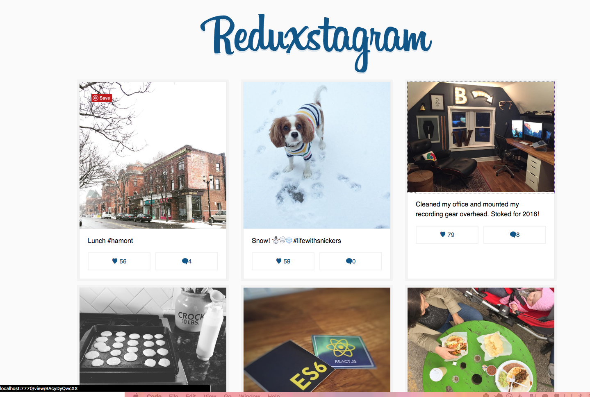

Taken and adapted from Wes Bos's "Learn Redux" at https://learnredux.com/

## INSTRUCTIONS

First `npm install` to grab all the necessary dependencies.
Then run `npm start` and open <localhost:7770> in your browser.
You will see your home page view with Reduxtagram written accross the top.

GOAL: To build a simple Instagram like React/Redux app with react-router that looks like this---

## Information that is good to have
All the data lives in the data folder. It is accessed via routes in devServer.js
You can get all the posts at '/api/posts' and all the comments at '/api/comments'. You can get a single post at '/api/posts/:id'
I made a bunch of empty files in components and containers folder. Don't feel like you need to use all of them. Or use all of them. I will help guide you if you want.
I made a file called HTML Files in the root directory with most of the html you will need to render. You will just have to make it do stuff.

# SOME GOALS
1. Think about what actions you may need. Some I used are RECEIVE_POSTS, ADD_COMMENT, INCREMENT_LIKES, etc. Define those in your types file in the action folder
2. Try to set up the RECEIVE_POSTS slice of the app. Aim to get a PhotoGridContainer component that has all the posts on its props. We can put that in the <IndexRoute> under the root path <Route> in app.js. That way, it will render under the Reduxstagram logo on the homepage.
